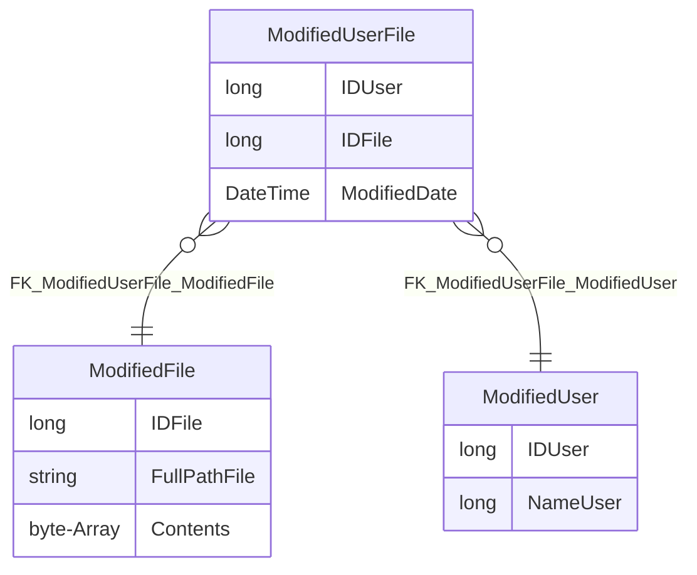



# ApplicationDBContext

```mermaid
erDiagram
    ModifiedFile {
      
      long IDFile 
      
      string FullPathFile 
      
      byte-Array Contents 
    
    }
    ModifiedUser {
      
      long IDUser 
      
      long NameUser 
    
    }
    ModifiedUserFile {
      
      long IDUser 
      
      long IDFile 
      
      DateTime ModifiedDate 
    
    }
    ModifiedUserFile }o--|| ModifiedFile : FK_ModifiedUserFile_ModifiedFile
    ModifiedUserFile }o--|| ModifiedUser : FK_ModifiedUserFile_ModifiedUser
```
